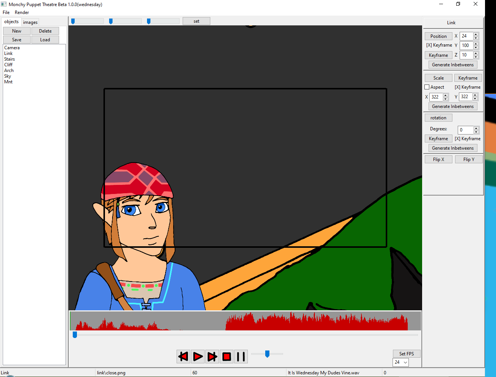

<!--
*** Thanks for checking out the Best-README-Template. If you have a suggestion
*** that would make this better, please fork the repo and create a pull request
*** or simply open an issue with the tag "enhancement".
*** Thanks again! Now go create something AMAZING! :D
***
***
***
*** To avoid retyping too much info. Do a search and replace for the following:
*** LaughterJerry, Puppet-Theatre, twitter_handle, laughteralan@gmail.com, Puppet Theatre, Puppet Theatre is a simple replacement for Flash after it was shut down by Adobe. Allowing the user to create animations in sync to sound at multiple framerates with frame-perfect accuracy. Manipulating the images also works during playback allowing the user to record live motions or set keyframes with linear interpolation
-->


<!-- PROJECT SHIELDS -->
<!--
*** I'm using markdown "reference style" links for readability.
*** Reference links are enclosed in brackets [ ] instead of parentheses ( ).
*** See the bottom of this document for the declaration of the reference variables
*** for contributors-url, forks-url, etc. This is an optional, concise syntax you may use.
*** https://www.markdownguide.org/basic-syntax/#reference-style-links
-->
<!--[![Issues][issues-shield]][issues-url]-->
[![MIT License][license-shield]][license-url]
[![LinkedIn][linkedin-shield]][linkedin-url]


<!-- PROJECT LOGO -->
<br />
<p align="center">
  <a href="https://github.com/LaughterJerry/Puppet-Theatre">
    
  </a>

  <h3 align="center">Puppet Theatre</h3>

  <p align="center">
    Puppet Theatre is a simple replacement for Flash after it was shut down by Adobe. Allowing the user to create animations in sync to sound at multiple framerates with frame-perfect accuracy. Manipulating the images also works during playback allowing the user to record live motions or set keyframes with linear interpolation
    <br />
    <a href="https://github.com/LaughterJerry/Puppet-Theatre"><strong>Explore the docs »</strong></a>
    <br />
    <br />
    <a href="https://github.com/LaughterJerry/Puppet-Theatre">View Demo</a>
    ·
    <a href="https://github.com/LaughterJerry/Puppet-Theatre/issues">Report Bug</a>
    ·
    <a href="https://github.com/LaughterJerry/Puppet-Theatre/issues">Request Feature</a>
  </p>
</p>


<!-- TABLE OF CONTENTS -->
<details open="open">
  <summary><h2 style="display: inline-block">Table of Contents</h2></summary>
  <ol>
    <li>
      <a href="#about-the-project">About The Project</a>
      <ul>
        <li><a href="#built-with">Built With</a></li>
      </ul>
    </li>
    <li>
      <a href="#getting-started">Getting Started</a>
      <ul>
        <li><a href="#prerequisites">Prerequisites</a></li>
        <li><a href="#installation">Installation</a></li>
      </ul>
    </li>
    <li><a href="#usage">Usage</a></li>
    <li><a href="#roadmap">Roadmap</a></li>
    <li><a href="#contributing">Contributing</a></li>
    <li><a href="#license">License</a></li>
    <li><a href="#contact">Contact</a></li>
    <li><a href="#acknowledgements">Acknowledgements</a></li>
  </ol>
</details>


<!-- ABOUT THE PROJECT -->
## About The Project


Puppet Theatre is a simple replacement for Flash after it was shut down by Adobe. Allowing the user to create animations in sync to sound at multiple framerates with frame-perfect accuracy. Manipulating the images also works during playback allowing the user to record live motions or set keyframes with linear interpolation


### Built With

* ![Language][language-source]
* ![Library][library-1]
* ![Library][library-2]
* ![Library][library-3]


### Installation

1. Download the installer
   ```sh
   https://github.com/LaughterJerry/Puppet-Theatre/blob/main/build/main/main.exe
   ```
2. run the installer


<!-- USAGE EXAMPLES -->
## Usage

Use this space to show useful examples of how a project can be used. Additional screenshots, code examples and demos work well in this space. You may also link to more resources.

_For more examples, please refer to the [Documentation](https://example.com)_


<!-- ROADMAP -->
## Roadmap

1 - turn help menus into a single function X

3 - move imagelist menus to imagelist - object_ctrl, image_list X

4 - move objectlist menus to object_list - object_ctrl, object_list X

21- turn all state_ctrl sub functions into menu options for keyboard shortcuts - pos_panel, rot_panel, scale_panel 
  abandoned because the shortcuts would be too numerous

2 - remove load check OBJ2D

12- sampler turned into object to retain audio waveform data - timeline_ctrl, sampler

13- remove slider and upgrade pygamepanel to act as timeline slider - timeline_ctrl

14- remove full resize event from pygamepanel, make it larger than it needs to be only resize waveform - timeline_ctrl

15- ?upgrade pygamepanel to act more like a pygame window with extra functionality - pygame_panel

22- add undo/redo feature, any time self.data is written to, copy.deepcopy to rolling list, add one to flow_control variable

  undo moves flow_control variable back one, redo adds one, doesnt change if index = 0 or len(list)

  changes made check if the current flow_control is at end of list, if not it truncates the list - whole project

23- unlimited object composition, post modern opengl

8 - add keystroke listener to render_ctrl, add key binds - render_ctrl

9 - adjust on_mouse_down for general purpose use, use resize viewbox- render_ctrl

5 - delete object should ask "are you sure" - object_list (also added to overwrite functions)

7 - check if update_object is needed - object_ctrl (yes it is)

24- add limited object composition - object_ctrl (very limited but it works!)

25- turn render panel into notebook, second page controls the current state of the render window

10- merge render frames and render to video - render_video_dialog, render_frames_dialog

27- renders to multiple resolutions

11- ?add feedback and statusbar of ffmpeg render - render_video_dialog

26- render output compatible with youtube and twitter

16- turn state_ctrl into notebook - state_ctrl

17- add overwrite panel to position panel - state_ctrl, pos_panel

18- add overwrite panel to rotation panel - state_ctrl, rot_panel

19- add overwrite panel to scale panel - state_ctrl, scale_panel

20- add flip panel to scale panel - state_ctrl, scale_panel


28- heirarchical drawing proccess:
  list all parents:
    parent.draw():  <-----------|
      self.transform()        |
      for child in children:  |
        child.draw() -------|


used shortcuts: N, O, S, A, X, shft+S, I, L, U, J, G, H, Z, Y

Beta
-------------------------------------------------------------------------------------
[X] 1.0.0 - "Better than Nothing"   Functional, bare bones

[X] 1.0.1 -               Code refactored, commented, and made maintainable

[X] 1.1.0 - "Family Sticks Together"  5, 6, 7, 24, Basic Composite objects added, parent/child relationship

[X] 1.2.0 - "Record me Daddy"     8, 9, add keybinds and fix mouse down, render_ctrl

[X] 1.2.1 -               1, 3, 4, 21,  Menu Overhaul

[X] 1.3.0 - "The Time Machine"      22, Add undo/redo

[X] 1.4.0 - "Soul Window"       12-15, Upgrade pygame panel to act as timeline control

[X] 1.5.0 - "Ultimate Porpoise"     10, 11, 25, 26, 27, render video overhaul

[X] 1.6.0 - "State of the Union"    16, 17, 18, 19, 20, state_ctrl overhaul

[X] 1.6.2 -               bug fixes, general tidying of functions

[X] 1.7.0 - "Soylent Peen"        28, added composite objects, saving and loading

[X] 1.7.1 -               Changing the point of origin of objects

[X] 1.7.2 -               Add point of origin state control

[X] 1.7.3 -               Repair stacked drawing and transparency issues

[X] 1.8.0 -               fix history memory issues

[X] 1.8.1 -               reverted edit history

[ ] 1.8.5 -               

[ ] 2.0.0 - "FuuuuuTuuuuure"      Migrate to modern opengl

[ ] 2.0.1 -               Code refactored, commented, and made maintainable

[ ] 2.1.0 -               23, Adding complex composite objects, full lineage using transformation hierarchy

[ ] 3.0.0 - "I C what you did there"  Migrate to C++

[ ] 3.0.1 -               Code refactored, commented, and made maintainable


<!-- CONTRIBUTING -->
## Contributing

Contributions are what make the open source community such an amazing place to be learn, inspire, and create. Any contributions you make are **greatly appreciated**.

1. Fork the Project
2. Create your Feature Branch (`git checkout -b feature/AmazingFeature`)
3. Commit your Changes (`git commit -m 'Add some AmazingFeature'`)
4. Push to the Branch (`git push origin feature/AmazingFeature`)
5. Open a Pull Request


<!-- LICENSE -->
## License

Distributed under the GPL v3. See `LICENSE` for more information.


<!-- CONTACT -->
## Contact

Jerry Laughter - laughteralan@gmail.com

Project Link: [https://github.com/LaughterJerry/Puppet-Theatre](https://github.com/LaughterJerry/Puppet-Theatre)


<!-- MARKDOWN LINKS & IMAGES -->
<!-- https://www.markdownguide.org/basic-syntax/#reference-style-links -->
[language-source]: https://img.shields.io/badge/Language-Python-green
[library-1]: https://img.shields.io/badge/Library-WxPython-red
[library-2]: https://img.shields.io/badge/Library-Pygame-red
[library-3]: https://img.shields.io/badge/Library-OpenGL-red

[contributors-shield]: https://img.shields.io/github/contributors/LaughterJerry/repo.svg?style=for-the-badge
[contributors-url]: https://github.com/LaughterJerry/repo/graphs/contributors
[forks-shield]: https://img.shields.io/github/forks/LaughterJerry/repo.svg?style=for-the-badge
[forks-url]: https://github.com/LaughterJerry/repo/network/members
[stars-shield]: https://img.shields.io/github/stars/LaughterJerry/repo.svg?style=for-the-badge
[stars-url]: https://github.com/LaughterJerry/repo/stargazers
[issues-shield]: https://img.shields.io/github/issues/LaughterJerry/repo.svg?style=for-the-badge
[issues-url]: https://github.com/LaughterJerry/repo/issues
[license-shield]: https://img.shields.io/badge/License-GPLv3-blue.svg
[license-url]: https://www.gnu.org/licenses/gpl-3.0
[linkedin-shield]: https://img.shields.io/badge/-LinkedIn-black.svg?style=for-the-badge&logo=linkedin&colorB=555
[linkedin-url]: https://www.linkedin.com/in/richard-laughter-a5687a213/
